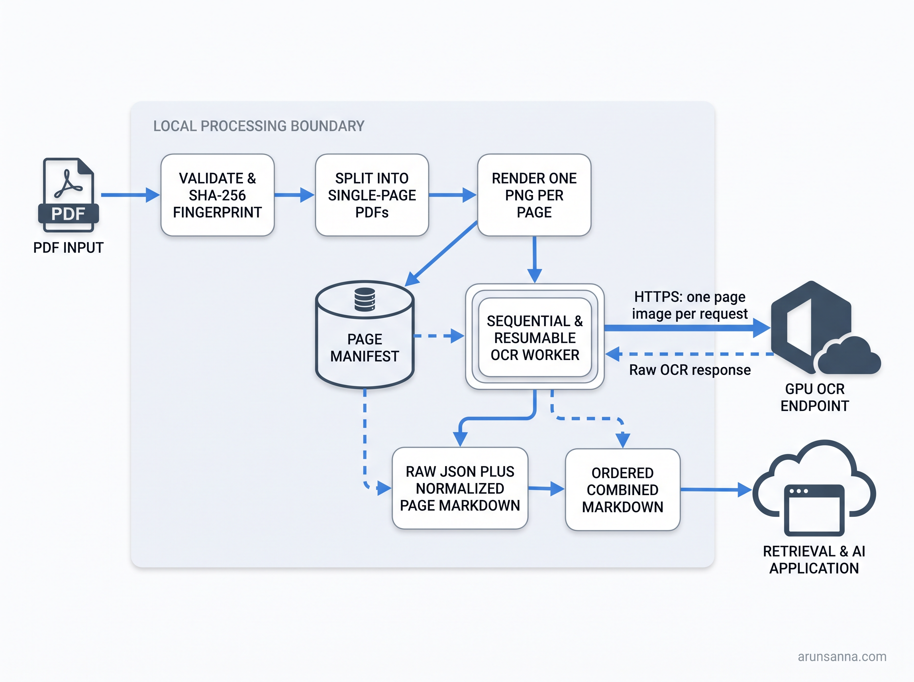
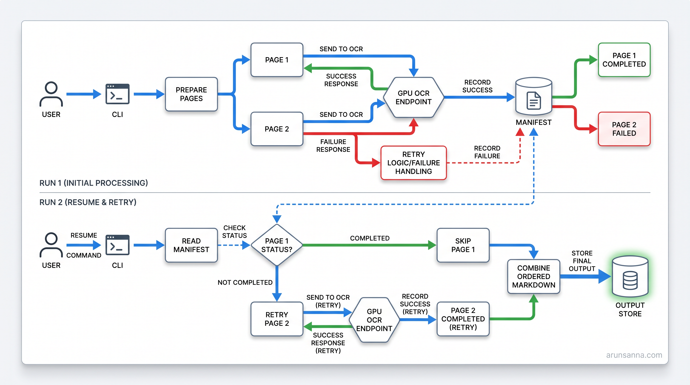

# PDF Page OCR

Turn a large PDF into page-addressable Markdown without making one oversized OCR request the unit of failure.

`pdf-page-ocr` prepares a document locally, sends one rendered page at a time to a GPU-backed OCR endpoint you configure, preserves the raw result and provenance for every page, and combines successful pages back into a single Markdown document. It is designed for reliable document extraction and for downstream retrieval or AI workflows that should fetch relevant extracted passages instead of repeatedly attaching an entire PDF.

> **Status:** 0.1 is under active development. The offline artifact pipeline is the first release target; a real GPU endpoint run is required before the Unlimited-OCR adapter is called production-ready.



## Why pages?

Whole-document OCR requests can fail late because one difficult or large PDF makes every page share the same memory and retry boundary. This tool makes each page an independent, resumable work item:

1. Validate, fingerprint, split, and render the PDF locally.
2. Store a manifest that records every page and its state.
3. OCR only pending pages, one request at a time by default.
4. Save raw OCR responses and normalized page Markdown.
5. Combine pages in source order only when the document is complete.

The result is inspectable, restartable, and compact enough to support page-aware RAG or LLM inputs. It does **not** claim a token-reduction percentage until that is measured on a published fixture set.

## CPU-safe by design; GPU OCR by configuration

| Runs locally on a normal CPU | Runs only at your configured GPU endpoint |
| --- | --- |
| PDF validation, SHA-256 fingerprinting, page splitting, PNG rendering, manifesting, resume logic, normalization, and Markdown combining | Unlimited-OCR model inference |

The default install does not download model weights, start a model server, or claim that Unlimited-OCR is supported as a local CPU model. The first adapter is for a user-controlled, OpenAI-compatible GPU OCR endpoint. Upstream Unlimited-OCR documents NVIDIA GPU-oriented inference and serving; see the [architecture notes](docs/architecture.md).

Pages do not leave the machine unless you configure an endpoint and run `ocr` or `run`. There is no telemetry, hosted service, or automatic upload in this project.

## Quick start

Requirements: Python 3.11 or 3.12 and [`uv`](https://docs.astral.sh/uv/). The installer will not fetch a model.

```bash
git clone https://github.com/arunsanna/pdf-page-ocr.git
cd pdf-page-ocr
./scripts/install.sh

# Verify local dependencies and output-directory permissions.
pdf-page-ocr doctor

# Create page PDFs, page images, and a manifest locally.
pdf-page-ocr prepare report.pdf --out runs/report --dpi 150

# Configure the endpoint only when you are ready to send pages to it.
export PDF_PAGE_OCR_ENDPOINT="https://ocr.example.internal/v1"
export PDF_PAGE_OCR_API_KEY="replace-with-your-key"
pdf-page-ocr ocr runs/report/manifest.json --adapter unlimited-ocr --resume

# Refuse partial output unless you explicitly opt in.
pdf-page-ocr combine runs/report/manifest.json --out runs/report/report.md
```

`run` is a convenience command for the same stages:

```bash
pdf-page-ocr run report.pdf --out runs/report --adapter unlimited-ocr --resume
```

It refuses to initiate OCR if no endpoint is configured. Use `prepare` alone when you only need local page artifacts.

## Command guide

| Command | Purpose | Network use |
| --- | --- | --- |
| `doctor` | Check the Python environment, local dependencies, output permissions, and optional endpoint configuration | None by default |
| `prepare INPUT.pdf --out DIR [--dpi 150]` | Validate, split, render, hash, and write a manifest | None |
| `ocr MANIFEST --adapter unlimited-ocr --resume` | Submit pending page images to the configured endpoint and persist responses | One page per request |
| `combine MANIFEST --out DOCUMENT.md [--allow-partial]` | Assemble ordered Markdown from completed page artifacts | None |
| `run INPUT.pdf --out DIR --adapter unlimited-ocr --resume` | Run the preparation, OCR, and combine workflow | Only during OCR |

The exact command help is the implementation contract. In 0.1, `--resume` skips pages marked successful when their page Markdown exists and reattempts pages that did not succeed. Requests are sequential: one page at a time. Artifact-hash verification before a resume skip and configurable concurrency are planned hardening work, not current claims.

## What a run produces

```text
runs/report/
├── manifest.json
├── source/
│   └── report.pdf
├── pages/
│   ├── page-0001.pdf
│   ├── page-0001.png
│   ├── page-0001.raw.json
│   ├── page-0001.md
│   └── ...
├── document.md
└── failures.jsonl                 # only when a page fails
```

`manifest.json` is the source of truth. It records the input hash, page number, rendering configuration, image hashes and dimensions, attempts, adapter/model metadata, timing, and Markdown hashes. It must never contain API keys or authorization headers.



## Security and data handling

- **Explicit egress:** `prepare`, `combine`, and a default `doctor` run are local-only. Page data is sent only to the endpoint you explicitly configure.
- **Page-level minimization:** the client submits one rendered page per request, not the entire PDF as a single request.
- **Secrets:** provide endpoint credentials through environment variables or your own secret manager; do not put them in commands, manifests, or committed configuration.
- **Artifacts:** runs can include source PDFs, images, and raw OCR responses. Put output directories in storage with access controls appropriate for the document.
- **Partial documents:** `combine` fails if pages are missing or failed unless `--allow-partial` is supplied; partial output must be visibly labeled.

Read the full [security guide](docs/security.md) before processing sensitive material.

## Limitations

- OCR is an extraction aid, not a guarantee of semantic or visual fidelity. Tables, equations, handwriting, low-quality scans, and complex diagrams need review.
- The first release is a client for a compatible GPU endpoint; it does not deploy or operate a model server for you.
- No public benchmark or token-saving percentage is claimed yet.
- Rendering DPI affects quality, latency, and storage. The manifest records it so comparisons remain reproducible.
- A future Docling adapter may offer a local CPU baseline, but it is not part of the initial Unlimited-OCR contract.

## Verification status

| Area | Status | What still proves it |
| --- | --- | --- |
| Pagewise design | Grounded in an internal page-by-page OCR experiment | Public fixture-based regression suite |
| Offline preparation and combining | Release target | Deterministic page/count/hash tests |
| Endpoint request handling | Release target | Fake-server contract tests, then an authorized GPU smoke run |
| GPU model quality | Not yet publicly benchmarked | Visual review of a mixed-content fixture corpus |
| Token savings | Not measured | Published method and artifacts before any numerical claim |

## Documentation

- [Architecture and trust boundary](docs/architecture.md)
- [Operations: runs, retries, and recovery](docs/operations.md)
- [Security and data handling](docs/security.md)
- [Contributing](CONTRIBUTING.md)
- [Third-party notices](THIRD_PARTY_NOTICES.md)

## License

This project is released under the [MIT License](LICENSE). Model services and endpoint infrastructure are separate systems with their own licenses, terms, and security responsibilities.
