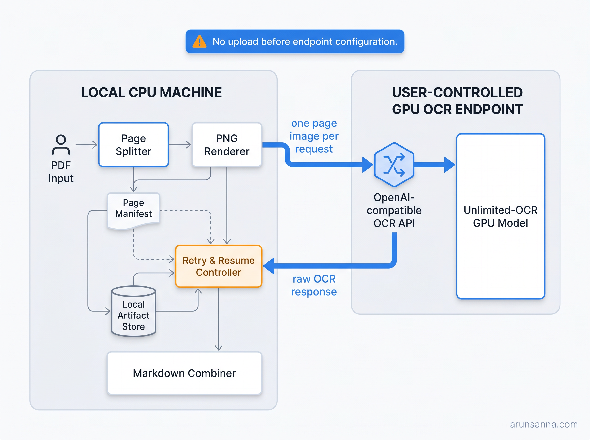

# Architecture

PDF Page OCR is a client-side artifact pipeline, not a model-serving platform. Its architecture deliberately isolates the local PDF workflow from optional remote model inference.



## Data flow

```text
PDF → validate + SHA-256 → split pages → render page PNGs → manifest
    → one-page endpoint request → raw response + normalized Markdown
    → ordered combine → document.md
```

The manifest is the durable coordinator. It records whether a page is pending, succeeded, or failed, plus source and page-image hashes. In 0.1, a resume skips a page marked successful when its Markdown artifact is present; artifact-hash verification before a skip is planned hardening work.

## Trust boundary

Everything through render, manifesting, retry selection, normalization, and combine runs on the local machine. The only intended outbound path is an individual rendered page sent after a user configures an OCR endpoint and invokes OCR. The endpoint returns a raw OCR response, which is stored locally before it is normalized.

This is not a promise that the configured endpoint is private or compliant. The endpoint's operator controls its network, retention, authentication, and model runtime. Users should choose an endpoint appropriate for the documents being processed.

## Endpoint adapter contract

The initial `unlimited-ocr` adapter targets an OpenAI-compatible chat-completions endpoint with a document-parsing prompt and one base64-encoded page image per request. Compatibility is more than the HTTP route: the selected serving stack must honor the upstream model's request and generation requirements. The client records the adapter profile, model identifier, and normalization version in the manifest.

Unlimited-OCR's upstream material describes NVIDIA GPU-oriented Transformers inference and vLLM/SGLang serving. This project therefore keeps GPU inference outside the default local installation. See the [upstream project](https://github.com/baidu/Unlimited-OCR) for its model/runtime requirements.

## Failure model

The page—not the PDF—is the execution unit. A page failure is recorded without discarding successful pages. On `--resume`, pages marked successful with a present Markdown artifact are skipped. `combine` refuses to produce an apparently complete document if a page is incomplete unless the caller supplies `--allow-partial`.

## Design boundaries

Included:

- Local validation, page splitting, rendering, manifests, and Markdown artifacts.
- A thin, timeout-bounded endpoint client.
- Page-level retries, provenance, and deterministic combine behavior.

Excluded from 0.1:

- Model hosting, GPU orchestration, Kubernetes resources, or credential brokering.
- A default local Unlimited-OCR runner or model download.
- Telemetry, SaaS storage, or automatic uploads.
